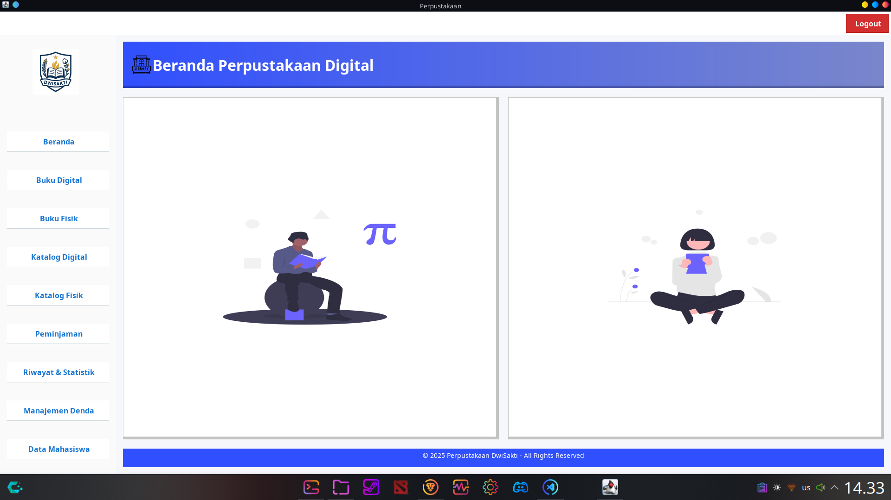
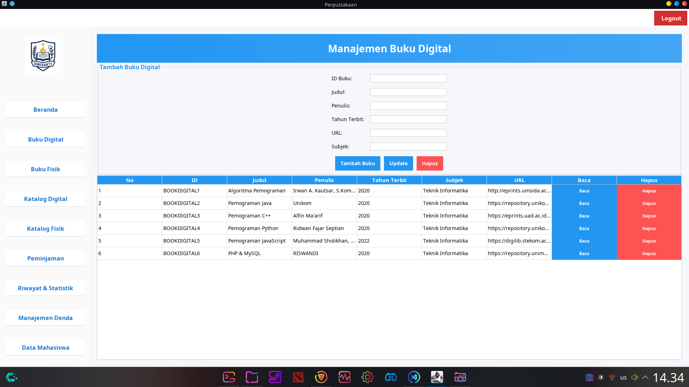
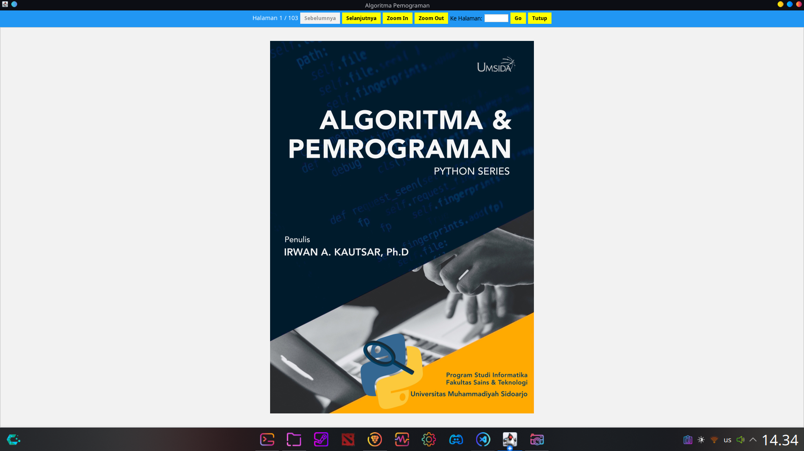
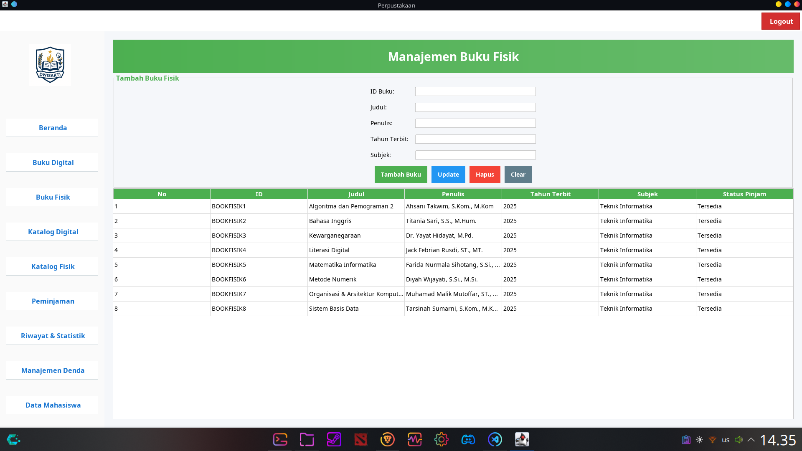
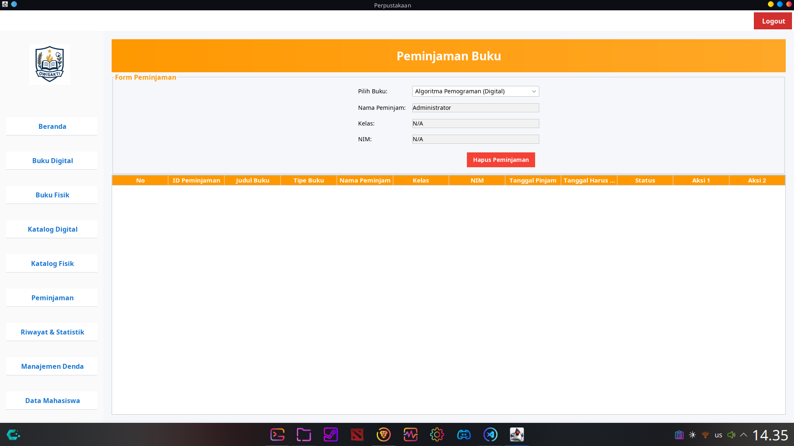
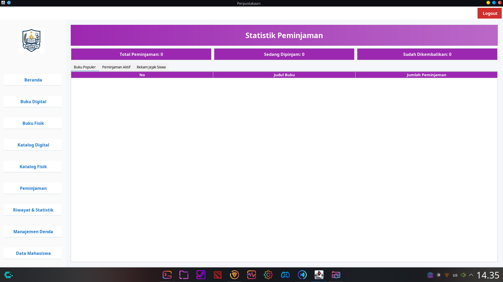
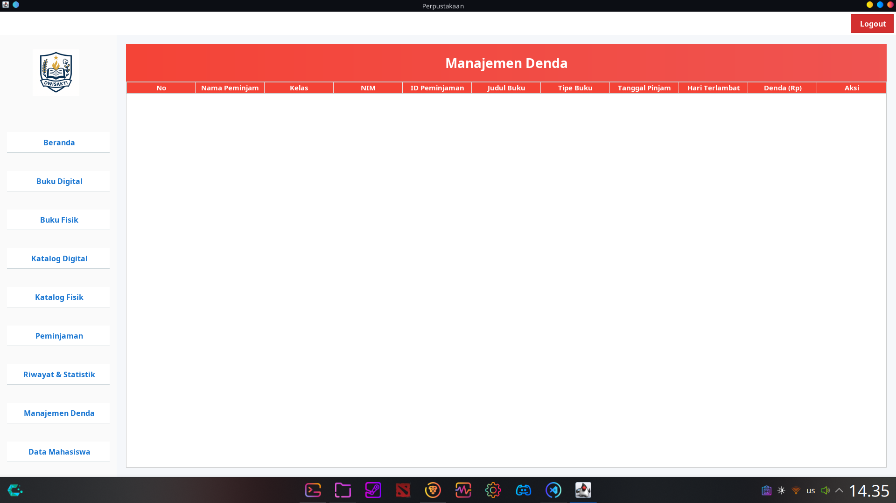
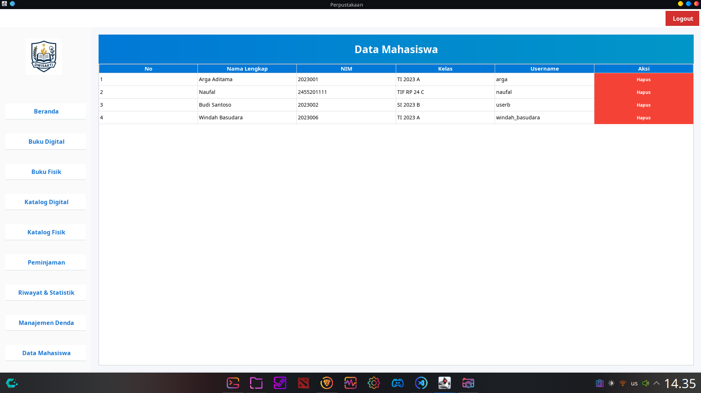
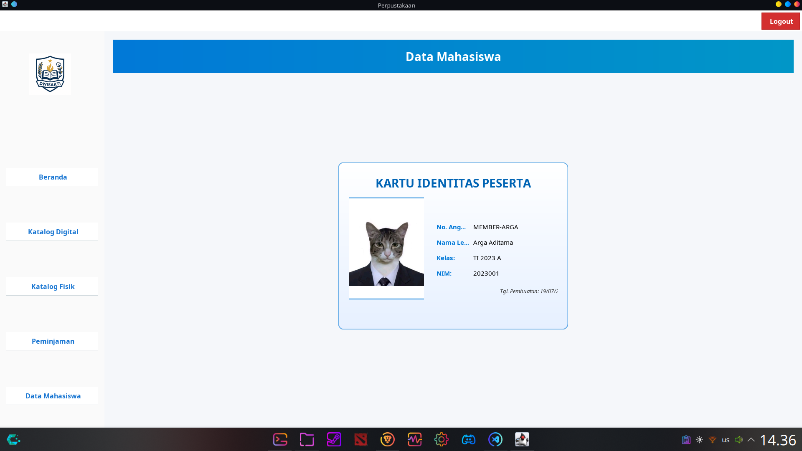

# 📚 Perpustakaan Digital Java

Selamat datang di repositori **Perpustakaan Digital** – sebuah aplikasi sistem manajemen perpustakaan berbasis Java yang dirancang untuk mengelola buku fisik dan digital, peminjaman, katalog, manajemen denda, serta statistik perpustakaan. Proyek ini dikembangkan untuk memenuhi kebutuhan perpustakaan modern melalui antarmuka pengguna yang intuitif dan fungsionalitas lengkap.

---

## 🎯 Fitur Utama

- **Manajemen Buku**: Tambah, ubah, dan hapus buku digital (dengan URL/PDF) serta buku fisik.
- **Peminjaman Buku**: Sistem peminjaman lengkap dengan status pengembalian dan denda otomatis.
- **Katalog Buku**: Katalog terpisah untuk buku fisik dan digital, dilengkapi fitur pencarian.
- **Manajemen Denda**: Pelacakan dan pengelolaan denda keterlambatan secara efisien.
- **Statistik Perpustakaan**: Statistik real-time mengenai aktivitas peminjaman.
- **Manajemen Pengguna**: Tambah, lihat, dan hapus akun pengguna (siswa/mahasiswa).
- **Antarmuka Modern**: Tampilan UI menggunakan FlatLaf untuk pengalaman pengguna yang lebih nyaman.

---

## 🖼️ Penjelasan Antarmuka

### 1. Halaman Login
Antarmuka awal aplikasi untuk autentikasi pengguna (admin atau mahasiswa).


### 2. Beranda
Menampilkan halaman beranda


### 3. Buku Digital
Kelola data buku digital: judul, penulis, tahun terbit, dan URL PDF.


### 4. Mode Baca
Pengguna dapat membaca buku digital langsung dari aplikasi melalui URL atau file PDF.


### 5. Buku Fisik
Manajemen buku fisik dengan fitur serupa, tanpa file PDF.


### 6. Peminjaman
Fitur peminjaman buku fisik maupun digital, form peminjaman, serta tombol pengembalian dan penambahan denda.


### 7. Statistik
Menampilkan grafik/statistik jumlah buku dipinjam, dikembalikan, dan total denda.


### 8. Manajemen Denda
Melacak pengguna yang memiliki denda, lengkap dengan jumlah dan opsi pengelolaan.


### 9. Data Mahasiswa (Tampilan Admin)
Tabel yang menampilkan daftar seluruh akun mahasiswa, dilengkapi dengan fitur pencarian dan tombol untuk menghapus akun.


### 10. Kartu Peserta (Tampilan User)
Tampilan kartu identitas digital untuk mahasiswa, menampilkan informasi pribadi dengan desain modern dan elegan. Foto akan disesuaikan agar pas dalam rasio 3x4.


---

## ⚙️ Teknologi yang Digunakan

- **Bahasa Pemrograman**: Java (JDK 24)
- **Framework UI**: Swing dengan tema modern dari [FlatLaf](https://www.formdev.com/flatlaf/)
- **Database**: MySQL via [JDBC](https://dev.mysql.com/downloads/connector/j/)

---

## 📦 Dependensi Eksternal

- `FlatLaf 3.3` – Tema UI
- `MySQL Connector/J 9.3.0` – Driver JDBC untuk koneksi database MySQL
- `PDFBox 2.0.27` – Library untuk membaca dan memanipulasi file PDF
- `Commons Logging 1.2` & `FontBox 2.0.27` – Dependensi untuk PDFBox

---

## 🔧 Prasyarat

- Java Development Kit (JDK 24 atau lebih baru)
- Server database MySQL berjalan (misalnya, melalui XAMPP, Laragon, atau instalasi mandiri)
- Dependensi `.jar` yang disebutkan di atas, ditempatkan dalam folder `lib/` di root proyek.

---

## 🚀 Instalasi & Penggunaan

### 1. Clone Repositori

Buka terminal (Command Prompt/PowerShell di Windows, Terminal di macOS/Linux) dan jalankan:

```bash
git clone https://github.com/areksaxyz/PerpusatakaanDwiSakti
cd PerpusatakaanDwiSakti
```
## Untuk macOS / Linux (Terminal)

### Kompilasi semua file Java
```bash
javac -d bin -cp "lib/*:bin" src/storage/*.java src/ui/*.java src/model/*.java
```
### Jalankan aplikasi
```bash
java -cp "bin:lib/*" ui.LibraryUI
```
## Untuk Windows (Command Prompt / PowerShell)

### Kompilasi semua file Java
```bash
javac -d bin -cp "lib\*;bin" src\storage\*.java src\ui\*.java src\model\*.java
```
### Jalankan aplikasi
```bash
java -cp "bin;lib\*" ui.LibraryUI
```
